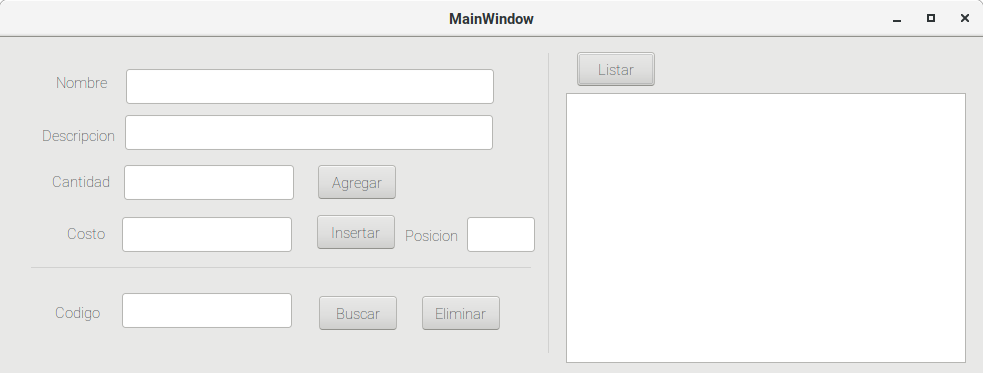

# Estructuras con Arreglos
Utilizando como estructura de datos un vector de 15 , desarrollar una aplicación que controle un CATALOGO o CONJUNTO de registros, el registro ya se definió en clases. Para el catalogo se podrá agregar, buscar, eliminar o insertar en una posición determinada un registro, además de obtener el reporte completo en string para poner en la caja de texto multilinea
Entregar en github y en clases el día 17 o 18 de abril según aplique.
Considerar la interfaz simple, como la imagen adjunta.

#### Interfaz
